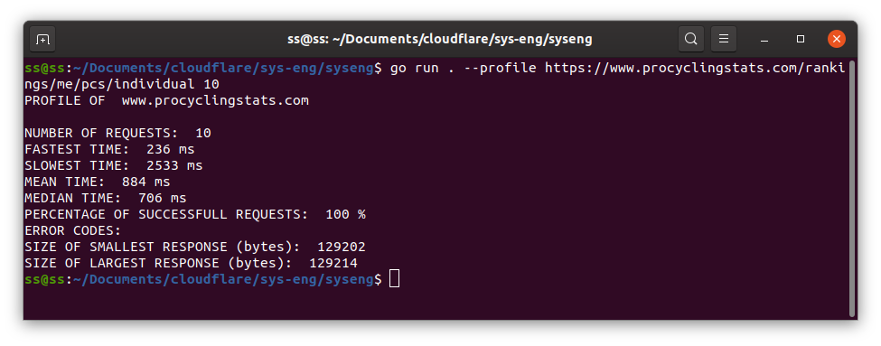

# Systems Engineering Requests Tool

## What is it?

I built a CLI tool for Cloudflare's 2021 Engineering Assesment which makes HTTP requests using sockets directly rather than using a library. The program can also return request statistics such as fastest/slowest times, median/mean times, response sizes etc.


### Installation
Install go from here https://golang.org/doc/install.
Once you have go installed, you should be ready to go!

### Usage

* Run ```go run . --help ``` to open up a help prompt with all usages and different flags allowed

* Run ```go run . --url <url>``` to get a full response from a website including status code and html

* Run ```go run . --profile <url> <number of requests>``` to profile a specific number of requests to a url

## Results

### General Results

Cloudflare Worker /links site


### Profile Stats Results
Cloudflare Worker Site


Cloudflare Worker /links site


Cloudflare.com


Cycling Stats site


Google.com Profile


### Analysis of Profile Stats Results
The websites that I'm comparing are mostly static to ensure comparability across websites. After trying my program out with a couple of dynamic and graphically dense websites, their load times were much higher than static and simple websites. This is due to less data needed to be sent to load the website.

I've compared 3 different types of websites: barebones, simple and standard websites. Barebone sites in this sample return just basic data types(string, json array). Simple sites have very minimal graphics and structure.

Note: The simple websites are not good comparisons as they still vary greatly in sizes(In this case, the cloudflare simple site is approx. 14 times smaller)

Given that the mean times for the Cloudflare based websites are:
* Cloudflare Workers /links: `53ms` (barebones site)
* Cloudflare Workers: `79ms` (simple website)
* Cloudflare.com: `136ms` (standard website)

The mean times across our sample of Non-Cloudflare based websites are:
* shakeebshams.github.io: `85ms` (barebones site)
* Google.com: `81ms` (simple website)
* Cycling stats: `884ms` (standard website)

We can see that for each website category(barebones, simple, standard), the cloudflare based websites have significantly lower response times for our samples. Given that our sample size is very small, we cannot make any hard conclusions between Cloudflare and Non-Cloudflare based websites.

Cloudflare barebones 53ms < Other barebones 85ms

Cloudflare simple 79ms < Other simple 81ms (BUT statistically insignificant as p<0.05)

Cloudflare standard 136ms < Other standard 884ms


If we were to take the sizes of the responses into consideration we end up with:
(All values are the largest response recieved, and we will assume response size is linear to response time)
* Cloudflare Workers /links: `1195 bytes` (53ms)
* Cloudflare Workers: `3818 bytes` (79ms)
* Cloudflare.com: `155094 bytes` (136ms)

* shakeebshams.github.io: `669 bytes` (85ms)
* Google.com: `50618 bytes` (81ms)
* Cycling stats: `129214 bytes` (884ms)

We can then calculate the average bytes recieved per milisecond:

Cloudflare barebones `22.55` > Other barebones `7.87`

Cloudflare simple `48.33` < Other simple `624.91` (Read note)

Cloudflare standard `1140.40` > Other standard `146.17`


Based on our comparisons, it seems apparent that Cloudflare's advantages come into play on larger websites with the higher rates of data transfer. The lower performance on Cloudflare's simple website is seemingly due to the response size being quite small (just 3818 bytes) compared to our "Other" website being sized at 50618 bytes. 


